# springbootA326
springbootA326美食分享系统LW+PPT
 
## 查看主页获取源码

### 一、作品包含

源码+数据库+设计文档万字+PPT+全套环境和工具资源+部署教程

### 二、项目技术

前端技术：Html、Css、Js、Vue、Element-ui

数据库：MySQL

后端技术：Java、Spring Boot、MyBatis

  

### 三、运行环境

开发工具：IDEA/eclipse

数据库：MySQL5.7

数据库管理工具：Navicat10以上版本

环境配置软件： JDK1.8+Maven3.6.3

前端Nodejs：14

### 四、项目介绍
项目编号：springbootA326

美食分享系统诞生于人们对美食的热爱与追求，随着互联网技术的飞速发展，它应运而生，为广大美食爱好者提供了一个互动交流的平台。在这个系统中，用户可以随时随地分享自己的美食体验，传播美食文化，从而形成一个美食共享、互动交流的美食社区。

前台用户功能：浏览首页、美食、美食笔记、公告信息、后台管理、个人中心。

后台分为管理员和用户
管理员的功能：系统首页、个人中心、用户管理、美食类别管理、美食管理、美食笔记管理、系统管理。
用户的功能：系统首页、个人中心、美食笔记管理。

### 五、运行截图

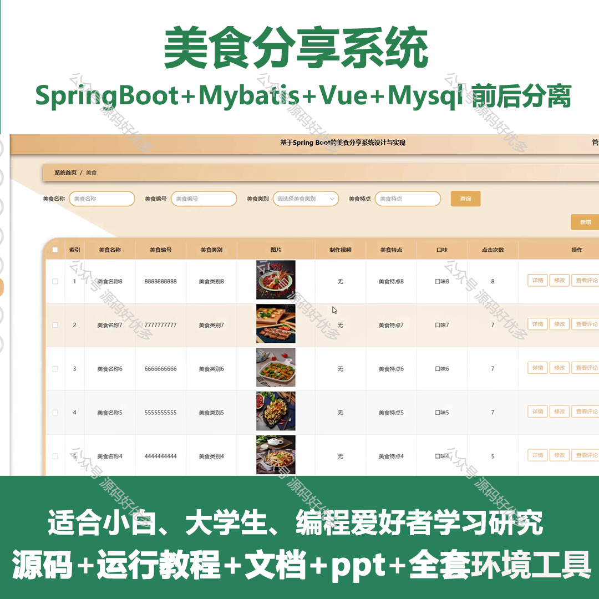
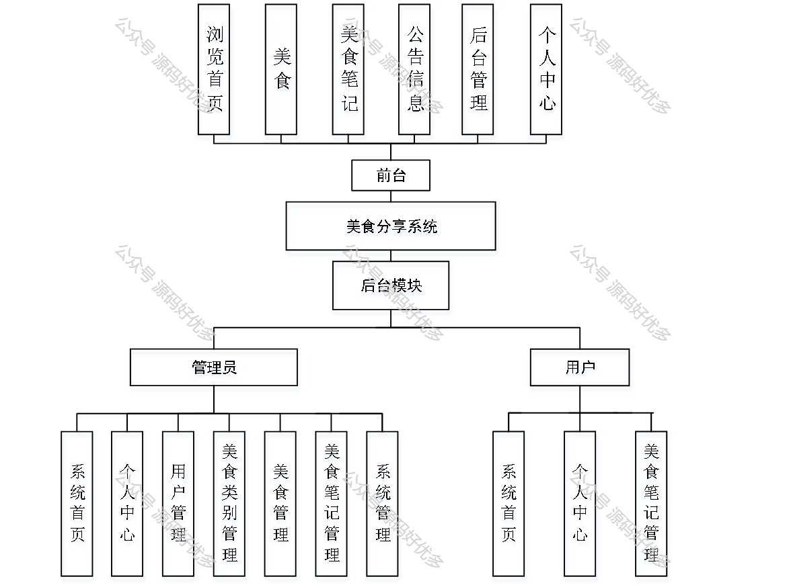
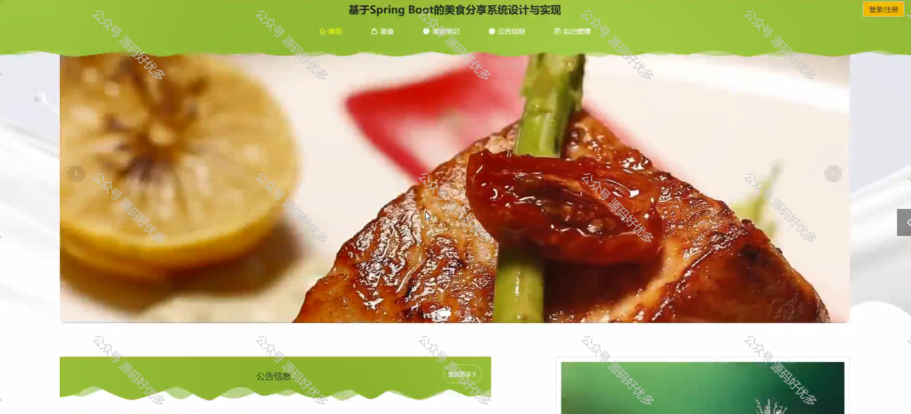
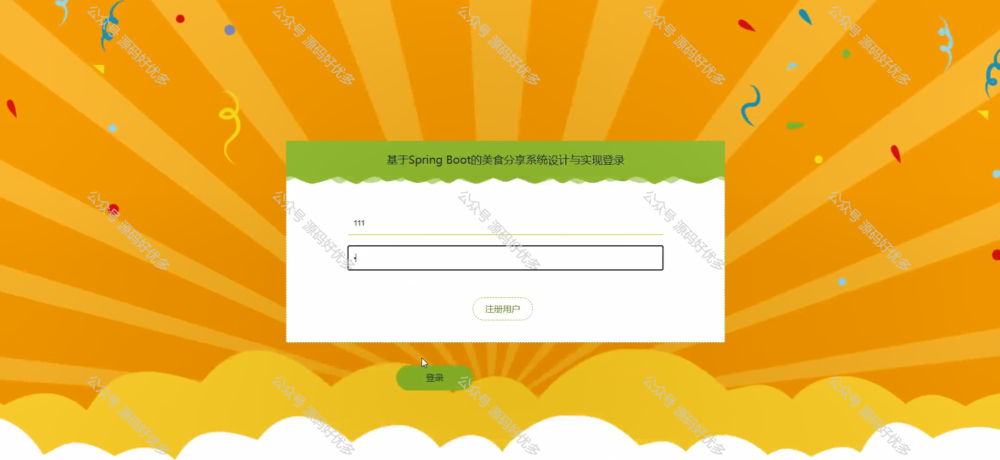
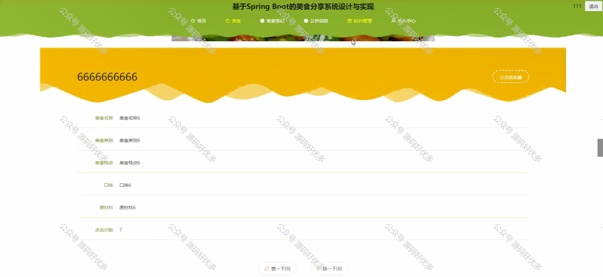
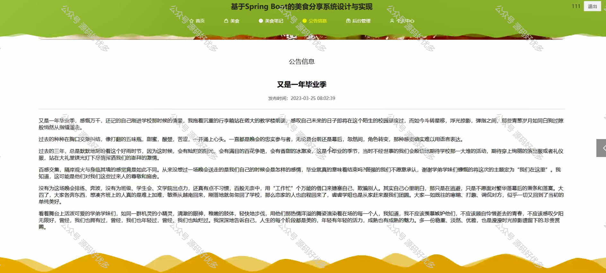
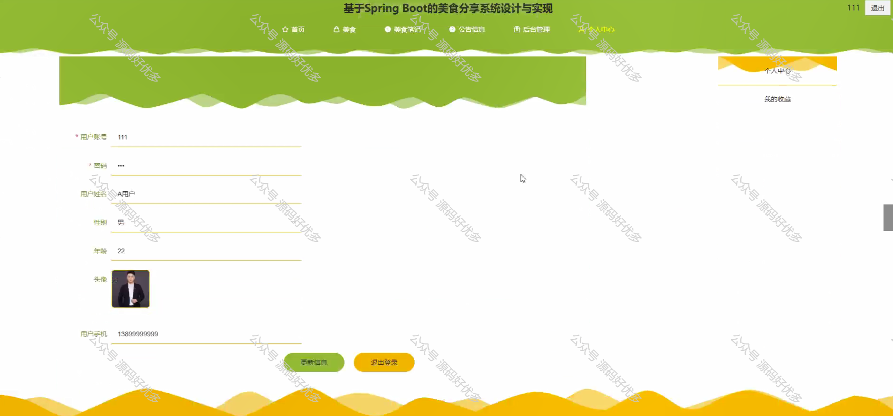
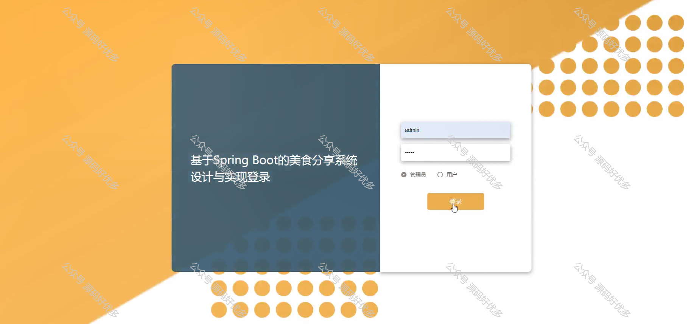
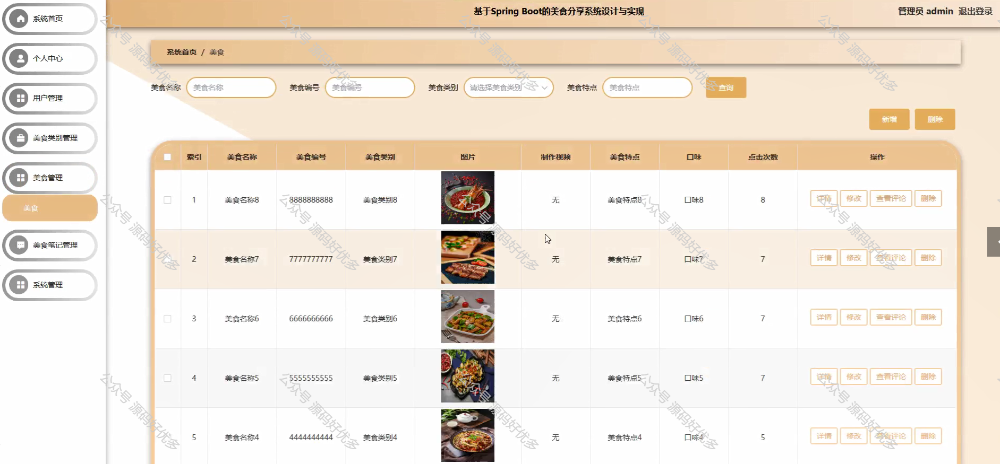
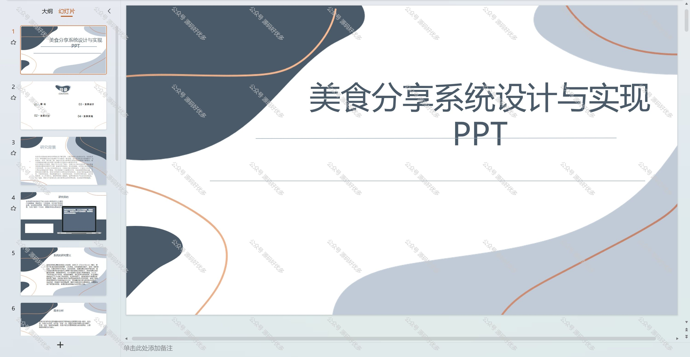
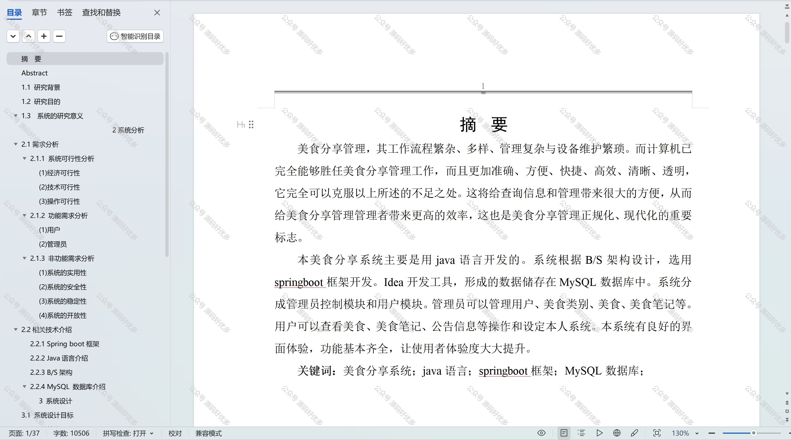

  
